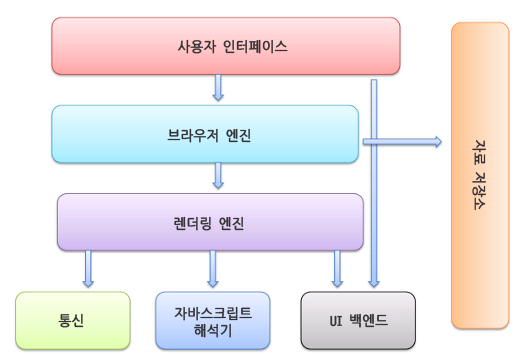
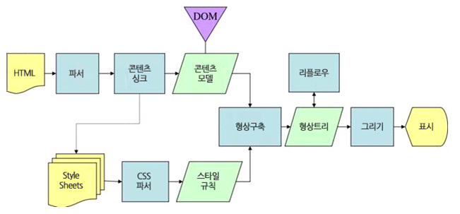
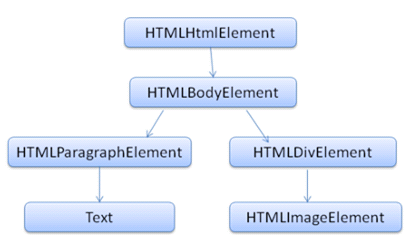
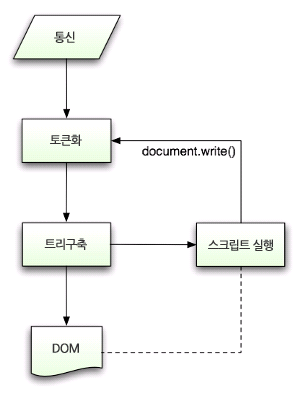
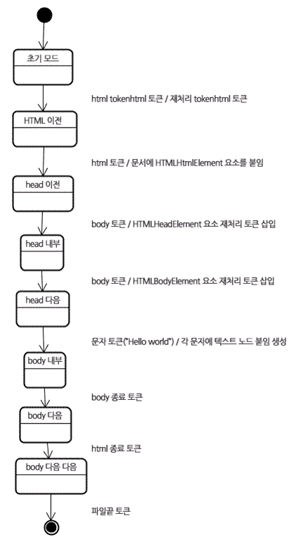

# 브라우저는 어떻게 동작하는가?

## 브라우저의 주요 기능

브라우저의 주요 기능은 사용자가 선택한 자원을 서버에 요청하고 브라우저에 표시하는 것이다. 자원은 보통 HTML 문서지만 PDF나 이미지 또는 다른 형태일 수 있다. 자원의 주소는 URI(Uniform Resource Identifier)에 의해 정해진다.

브라우저는 HTML과 CSS 명세에 따라 HTML 파일을 해석해서 표시하는데 이 명세는 웹 표준화 기구인 W3C(World Wide Web Consortium)에서 정한다. 

브라우저의 사용자 인터페이스는 서로 닮아 있는데 다음과 같은 요소들이 일반적이다.

- URI를 입력할 수 있는 주소 표시 줄
- 이전 버튼과 다음 버튼
- 북마크
- 새로 고침 버튼과 현재 문서의 로드를 중단할 수 있는 정지 버튼
- 홈 버튼

## 브라우저의 기본 구조

### 브라우저의 주요 구성 요소

1. 사용자 인터 페이스 - 주소 표시줄, 이전/다음 버튼, 북마크 메뉴 등 요청한 페이지를 보여주는 창을 제회한 나머지 모든 부분이다.
2. 브라우저 엔진 - 사용자 인터페이스와 렌더링 엔진 사이의 동작을 제어한다.
3. 렌더링 엔진 - 요청한 콘텐츠를 표시한다.
4. 통신 - HTTP 요청과 같은 네트워크 호출에 사용된다. 플랫폼 독립적인 인터페이스이고 각 플랫폼 하부에서 실행된다.
5. UI 백엔드 - 콤보 박스와 창 같은 기본적인 장치를 그린다. 플랫폼에서 명시하지 않은 일반적인 인터페이스로서, OS 사용자 인터페이스 체계를 사용한다.
6. 자바스크립트 해석기 - 자바스크립트 코드를 해석하고 실행한다.
7. 자료 저장소 - 자료를 저장하는 계층이다. 쿠키를 저장하는 것과 같이 모든 종류의 자원을 하드 디스크에 저장할 필요가 있다. HTML5 명세에는 브라우저가 지원하는 '웹 데이터 베이스'가 정의되어 있다.



> 크롬은 대부분의 브라우저와 달리 각 탭마다 별도의 렌더링 엔진 인스턴스를 유지한다. 따라서 각 탭은 독립된 프로세스로 처리된다.

## 렌더링 엔진

렌더링 엔진은 요청 받은 내용을 브라우저 화면에 표시한다.

렌더링 엔진은 HTML 및 XML 문서와 이미지를 표시할 수 있다. 플러그인이나 브라우저 확장 기능을 이용해 PDF와 같은 다른 유형도 표시할 수 있다.

### 렌더링 엔진들

- 게코(Gecko) 엔진
    - 파이어폭스
- 웹킷(Webkit) 엔진
    - 사파리
    - 크롬

### 동작 과정

렌더링 엔진은 통신으로부터 요청한 문서의 내용을 얻는 것으로 시작하는데 문서의 내용은 보통 8KB 단위로 전송된다.


1. HTML  문서를 파싱하고 "콘텐츠 트리" 내부에서 태그를 DOM 노드로 변환한다. 
2. 외부 CSS 파일과 함께 포함된 스타일 요소도 파싱한다. 스타일 정보와 HTML 표시 규칙은 "렌더 트리" 라고 부르는 또 다른 트리를 생성한다.
3. 렌더 트리 생성이 끝나면 배치가 시작된다. 이것은 각 노드가 화면의 정확한 위치에 표시되는것을 의미한다.
4. UI 백엔드에서 렌더 트리의 각 노드를 가로지르며 형상을 만들어내는 그리기 과정이 이루어진다.

렌더링 엔진은 좀 더 나은 사용자 경험을 위해 가능하면 빠르게 내용을 표시하는데 모든 HTML을 파싱할 때까지 기다리지 않고 배치와 그리기 과정을 시작한다. 네트워크로부터 나머지 내용이 전송되기를 기다리는 동시에 받은 내용의 일부를 먼저 화면에 표시하는 것이다.




게코는 시각적으로 처리되는 렌더 트리를 "형상 트리(frame tree)"라고 부르고 각 요소를 형상(frame)이라고 하는데 웹킷은 "렌더 객체(render object)"로 구성되어 있는 "렌더 트리(render tree)"라는 용어를 사용한다. 웹킷은 요소를 배치하는데 "배치(layout)"라는 용어를 사용하지만 게코는 "리플로(reflow)"라고 부른다. "어태치먼트(attachment)"는 웹킷이 렌더 트리를 생성하기 위해 DOM 노드와 시각 정보를 연결하는 과정이다. 게코는 HTML과 DOM 트리 사이에 "콘텐츠 싱크(content sink)"라고 부르는 과정을 두는데 이는 DOM 요소를 생성하는 공정으로 웹킷과 비교하여 의미있는 차이점이라고 보지는 않는다.

## 파싱과 DOM 트리 구축

### 파싱 일반

문서 파싱은 브라우저가 코드를 이해하고 사용할 수 있는 구조로 변환하는 것을 의미한다. 파싱 결과는 보통 문서 구조를 나타내는 노드 트리인데 파싱 트리(parse tree) 또는 문법 트리(syntax tree)라고 부른다.

### 문법

파싱은 문서에 작성된 언어 또는 형식의 규칙에 따르는 데 파싱할 수 있는 모든 형식은 정해진 용어와 구문 규칙에 따라야 한다. 이것을 문맥 자유 문법이라고 한다. 인간의 언어는 이런 모습과는 다르기 때문에 기계적으로 파싱이 불가능한다.

### 파서 - 어휘 분석기 조합

파싱은 어휘 분석과 구문 분석이라는 두 가지로 구분할 수 있다.

- 어휘 분석: 자료를 토큰으로 분해하는 과정
- 구문 분석: 언어의 구문 규칙을 적용하는 과정

파서는 보통 두 가지 일을 하는데 자료를 유효한 토큰으로 분해하는 어휘 분석기(토큰 변환기)가 있고 언어 구문 규칙에 따라 문서 구조를 분석함으로써 파싱 트리를 생성하는 파서가 있다. 어휘 분석기는 공백과 줄 바꿈 같은 의미 없는 문자를 제거한다.


파싱 과정은 반복된다. 파서는 보통 어휘 분석기로부터 새 토큰을 받아서 구문 규칙과 일치하는지 확인한다. 규칙에 맞으면 토큰에 해당하는 노드가 파싱 트리에 추가되고 파서는 또 다른 토큰을 요청한다.

규칙에 맞지 않으면 파서는 토큰을 내부적으로 저장하고 토큰과 일치하는 규칙이 발견될 때까지 요청한다. 맞는 규칙이 없는 경우 예외로 처리하는데 이것은 문서가 유효하지 않고 구문 오류를 포함하고 있다는 의미이다.

### 변환

파서 트리는 최종 결과물이 아니다. 파싱은 보통 문서를 다른 양식으로 변환하는데 컴파일이 하나의 예가 된다. 소스 코드를 기계 코드로 만드는 컴파일러는 파싱 트리 생성 후 이를 기계 코드 문서로 변환한다.


### 어휘와 구문에 대한 공식적인 정의

어휘는 보통 정규 표현식으로 표현한다.

```
INTEGER : 0|[1-9][0-9]*  
PLUS : +  
MINUS : -  
```

구문은 보통 BNF 라고 부르는 형식에 따라 정의한다. 

```
expression := term operation term  
operation := PLUS | MINUS  
term := INTEGER | expression  
```

문법이 문맥 자유 문법이라면 언어는 정규 파서로 파싱할 수 있다. 문맥 자유 문법을 쉽게 말하면 완전히 BNF로 표현 가능한 문법이다. 

### 파서의 종류

#### 하향식 파서

구문의 상위 구조로부터 일치하는 부분을 찾기 시작한다. 표현식에 해당하는 높은 수준의 규칙을 먼저 찾는다. 표현식을 찾는 과정은 일치하는 다른 규칙을 점진적으로 더 찾아내는 방식인데 어쨌거나 가장 높은 수준의 규칙을 먼저 찾는 것으로부터 시작한다.

#### 상향식 파서

낮은 수준에서 점차 높은 수준으로 찾는다. 입력 값이 규칙에 맞을 때까지 찾아서 맞는 입력 값을 규칙으로 바꾸는데 이 과정은 입력 값의 끝까지 진행된다. 부분적으로 일치하는 표현식은 파서 스택에 쌓인다. 입력 값의 오른쪽으로 이동하면서(입력 값의 처음을 가리키는 포인터가 오른쪽으로 이동하는 것을 상상) 구문 규칙으로 갈수록 남는 것이 점차 감소하기 때문에 이동 - 감소 파서라고 부른다.

### 파서 자동 생성

파서를 생성해 줄 수 있는 도구를 파서 생성기라고 한다. 언어에 어휘나 구문 규칙 같은 문법을 부여하면 동작하는 파서를 만들어 준다. 파서를 생성하는 것은 파싱에 대한 깊은 이해를 필요로 하고 수동으로 파서를 최적화하여 생성하는 것은 쉬운 일이 아니기 때문에 파서 생성기는 매우 유용하다.

웹킷은 잘 알려진 두 개의 파서 생성기를 사용한다. 어휘 생성을 위한 플렉스(Flex)와 파서 생성을 위한 바이슨(Bison)이다. 플렉스는 토큰의 정규 표현식 정의를 포함하는 파일을 입력 받고 바이슨은 BNF 형식의 언어 구문 규칙을 입력 받는다.

## HTML 파서

HTML 파서는 HTML 마크업을 파싱 트리로 변환한다.

### HTML 문법 정의

HTML의 어휘와 문법은 W3C에 의해 명에로 정의되어 있다.

### 문맥 자유 문법이 아님

문법은 BNF와 같은 형식을 이용하여 공식적으로 정의할 수 있다.

모든 전통적인 파서는 HTML에 적용할 수 없다. 파싱은 CSS와 자바스크립트를 파싱하는 데 사용된다. HTML은 파서가 요구하는 문맥 자유 문법에 의해 쉽게 정의할 수 없다.

HTML 정의를 위한 공식적인 형식으로 DTD(문서 형식 정의)가 있지만 이것은 문맥 자유 문법이 아니다.

이것은 언뜻 이상하게 보일 수도 있는데 HTML이 XML과 유사하기 때문이다. 사용할 수 있는 XML 파서는 많다. HTML을 XML 형태로 재구성한 XHTML도 있는데 무엇이 큰 차이점일까?

HTML과 XML의 차이점은 HTML이 더 "너그럽다"는 점이다. HTML은 암묵적으로 태그에 대한 생략이 가능하다. 가끔 시작 또는 종료 태그 등을 생략한다. 전반적으로 뻣뻣하고 부담스러운 XML에 반하여 HTML은 "유연한" 문법이다.

HTML은 공식적인 문법으로 작성하기 어렵게 만드는 문제가 있다. 정리하자면 HTML은 파싱하기 어렵고 전통적인 구문 분석이 불가능하기 때문에 문맥 자유 문법이 아니라는 것이다.  XML 파서로도 파싱하기 쉽지 않다. 

### HTML DTD

HTML의 정의는 DTD 형식 안에 있는데 SGML 계열 언어의 정의를 이용한 것이다. 이 형식은 허용되는 모든 요소와 그들의 속성 그리고 중첩 구조에 대한 정의를 포함한다.

DTD는 여러 변종이 있다. 엄격한 형식은 명세만을 따르지만 다른 형식은 다른 브라우저에서 사용된 마크업을 지원한다. 낡은 마크업을 지원하는 이유는 오래된 콘텐츠에 대한 하위 호환성 때문이다.

### DOM

`파싱 트리` 는 DOM 요소와 속성 노드의 트리로서 출력 트리가 된다. DOM은 문서 객체 모델(Document Object Model)의 준말이다. 이것은 HTML 문서의 객체 표현이고 외부를 향하는 자바스크립트와 같은 HTML 요소의 연결 지점이다. 트리의 최상위 객체는 문서다.

DOM 은 마크업과 1:1의 관계를 맺는다.

```html
<html>
  <body>
    <p>Hello World</p>
    <div></div>
  </body>
</html> 
```

이것은 아래와 같은 DOM 트리로 변환할 수 있다.



HTML과 마찬가지로 DOM은 W3C에 의해 명세가 정해져 있다. 이것은 문서를 다루기 위한 일반적인 명세인데 부분적으로 HTML 요소를 설명하기도 한다.

트리가 DOM 노드를 포함한다고 말하는 것은 DOM 접점의 하나를 실행하는 요소를 구성한다는 의미다. 브라우저는 내부의 다른 속성들을 이용하여 이를 구체적으로 실행한다.

### 파싱 알고리즘

HTML은 다음과 같은 이유로 일반적인 하향식 또는 상향식 파서로 파싱이 되지 않는다.

1. 언어의 너그러운 속성.
2. HTML  오류에 대한 브라우저의 관용
3. 변경에 의한 재파싱. 일반적으로 소스는 파싱하는 동안 변하지 않지만 HTML에서 document.write을 포함하고 있는 스크립트 태그는 토큰을 추가할 수 있기 때문에 실제로는 입력 과정에서 파싱이 수정된다.

일반적인 파싱 기술을 사용할 수 없기 때문에 브라우저는 HTML 파싱을 위해 별도의 파서를 생성한다.

파싱 알고리즘은 토큰화와 트리 구축 두 단계로 되어있다.

토큰화는 어휘 분석으로서 입력 값을 토큰으로 파싱한다. HTML에서 토큰은 시작 태그, 종료 태그, 속성 이름과 속성 값이다.

토큰화는 토큰을 인지해서 트리 생성자로 넘기고 다음 토큰을 확인하기 위해 다음 문자를 확인한다. 입력의 마지막까지 이 과정을 반복한다.



### 토큰화 알고리즘

알고리즘의 결과물은 HTML 토큰이다. 알고리즘은 상태 기계(Stage Machine)라고 볼 수 있다. 각 상태는 연속된 문자를 입력 받아 이 문자에 따라 다음 상태를 갱신한다. 그러나 결과는 현재의 토큰화 상태와 트리 구축 상태의 영향을 받는데, 이것은 같은 문자를 읽어 들여도 현재 상태에 따라 다음 상태의 결과가 다르게 나온다는 것을 의미한다.

```html
<html>
  <body>
    Hello world
  </body>
</html>
```

초기 상태는 `자료 상태` 이다. `<` 문자를 만나면 상태는 `태그 열림 상태` 로 변한다. a 부터 z 까지의 문자를 만나면 `시작 태그 토큰` 을 생성하고  상태는 `태그 이름 상태` 로 변하는데 이 상태는 `>` 문자를 만날 때까지 유지한다. 각 문자에는 토큰 이름이 붙는데 이 경우 생성된 토큰은 `html 토큰` 이다.

`>` 문자에 도달하면 현재 토큰이 발행되고 상태는 다시 `자료 상태` 로 바뀐다. 태그는 동일한 절차에 따라 처리된다. 지금까지 html 태그와 body 태그를 발행했고 다시 `자료 상태` 로 돌아왔다. Hello world의 H 문자를 만나면 문자 토큰이 생성되고 발행될 것이다. 이 것은 종료 태그의 `<` 문자를 만날 때까지 진행된다. Hello world의 각 문자를 위한 문자 토큰을 발행할 것이다.

다시 `태그 열림 상태` 가 되었다. `/` 문자는 종료 태그 토큰을 생성하고 `태그 이름 상태` 로 변경 될 것이다. 이 상태는 `>` 문자를 만날 때까지 유지된다. 그리고 새로운 태그 토큰이 발행되고 다시 `자료 상태` 가 된다.


### 트리 구축 알고리즘

파서가 생성되면 문서 객체가 생성된다. 트리 구축이 진행되는 동안 문서 최상단에서는 DOM 트리가 수정되고 요소가 추가된다. 토큰화에 의해 발행된 각 노드는 트리 생성자에 의해 처리된다. 각 토큰을 위한 DOM 요소의 명세는 정의되어 있다. DOM 트리에 요소를 추가하는 것이 아니라면 열린 요소는 스택(임시 버퍼 저장소)에 추가된다. 이 스택은 부정확한 중첩과 종료되지 않은 태그를 교정한다. 알고리즘은 상태 기계라고 설명할 수 있고 상태는 `삽입 모드` 라고 부른다.

```html
<html>
  <body>
    Hello world
  </body>
</html>
```

트리 구축 단계의 입력 값은 토큰화 단계에서 만들어지는 일련의 토큰이다. 받은 html 토큰은 `html 이전` 모드가 되고 토큰은 이 모드에서 처리된다. 이것은 HTMLHtmlElement 요소를 생성하고 문서 객체 최상단에 추가된다.

상태는 `head 이전` 모드로 바뀌었고 body 토큰을 받았다. head 토큰이 없더라도 HTMLHeadElement는 묵시적으로 생성되어 트리에 추가될 것이다.

곧이어 `head 안쪽` 모드로 이동했고 다음은 `head 다음` 모드로 간다. body 토큰이 처리 되었고 HTMLBodyElement가 생성되어 추가됐으며 `body 안쪽` 모드가 되었다.

`Hellow world` 문자열의 문자 토큰을 받았다. 첫 번째 토큰이 생성되고 "본문" 노드가 추가되면서 다른 문자들이 그 노드에 추가될 것이다.

body 종료 토큰을 받으면 `body 다음` 모드가 된다. html 종료 태그를 만나면 `body 다음 다음` 모드로 바뀐다. 마지막 파일 토큰을 받으면 파싱을 종료한다.



### 파싱이 끝난 이후의 동작

이번 단계에서 브라우저는 문서와 상호작용할 수 있게 되고 문서 파싱 이후에 실행되어야 하는 `지연` 모드 스크립트를 파싱하기 시작한다. 문서 상태는 `완료` 가 되고 `로드` 이벤트가 발생한다. 

### 브라우저의 오류 처리

HTML 페이지에서 `유효하지 않은 구문` 이라는 오류를 본 적이 없을 것이다. 이는 브라우저가 모든 오류 구문을 교정하기 때문이다.

```html
<html>
  <mytag></mytag>
  <div>
    <p>
  </div>
  Really lousy HTML
  </p>
</html>
```

`mytag` 는 표준 태그가 아니고 `p` 태그와 `div" 태그는 중첩 오류가 있다. 그러나 브라우저는 투덜거리지 않고 올바르게 표시하는데 이는 파서가 HTML 제작자의 실수를 수정했기 때문이다.

파서는 토큰화된 입력 값을 파싱하여 문서를 만들고 문서 트리를 생성한다. 규칙에 맞게 잘 작성된 문서라면 파싱이 수월하겠지만 불행하게도 형식에 맞지 않게 작성된 많은 HTML 문서를 다뤄야 하기 때문에 파서는 오류에 대한 아량이 있어야 한다.

파서는 적어도 다음과 같은 오류를 처리해야 한다.

1. 어떤 태그의 안쪽에 추가하려는 태그가 금지된 것일 때 일단 허용된 태그를 먼저 닫고 금지된 태그는 외부에 추가한다.
2. 파서가 직접 요소를 추가해서는 안된다. 문서 제작자에 의해 뒤늦게 요소가 추가될 수 있고 생략 가능한 경우도 있다. HTML, HEAD, BODY, TBODY, TR, TD, LI 태그가 이런 경우에 해당한다.
3. 인라인 요소 안쪽에 블록 요소가 있는 경우 부모 블록 요소를 만날 때까지 모든 인라인 태그를 닫는다.
4. 이런 방법이 도움이 되지 않으면 태그를 추가하거나 무시할 수 있는 상태가 될 때까지 요소를 닫는다.

웹킷이 오류를 처리하는 예는 다음과 같다.

#### \<br\> 대신 \</br\>

어떤 사이트는 \<br\> 대신 \</br\>을 사용한다. 인터넷 익스플로러, 파이어폭스와 호환성을 갖기 위해 웹킷은 이것을 <br> 으로 간주한다. 코드는 다음과 같다.

```c++
if(t->isCloseTag(brTag) && m_document->inCompatMode()) {  
  reportError(MalformedBRError);
  t->beginTag = true;
}
```

오류는 내부적으로 처리하고 사용자에게는 표시하지 않는다.

#### 어긋난 표

어긋난 표는 표 안에 또 다른 표가 th 또는 td 셀 내부에 있지 않은 것을 의미한다.

```html
<table>
  <table>
  <tr><td>inner table</td></tr>
  </table>
  <tr><td>outer table</td></tr>
</table>  
```

웹킷은 표의 중첩을 분해하여 형제 요소가 되도록 처리한다.

```html
<table>
  <tr><td>outer table</td></tr>
</table>
<table>
  <tr><td>inner table</td></tr>
</table>  
```

코드는 다음과 같다.

```c++
if(m_inStrayTableContent && localName == tableTag)  
popBlock(tableTag);  
```

# References

[How Browsers Work: Behind the scenes of modern web browsers](https://www.html5rocks.com/en/tutorials/internals/howbrowserswork/)  
[브라우저는 어떻게 동작하는가? - Naver D2](https://d2.naver.com/helloworld/59361)