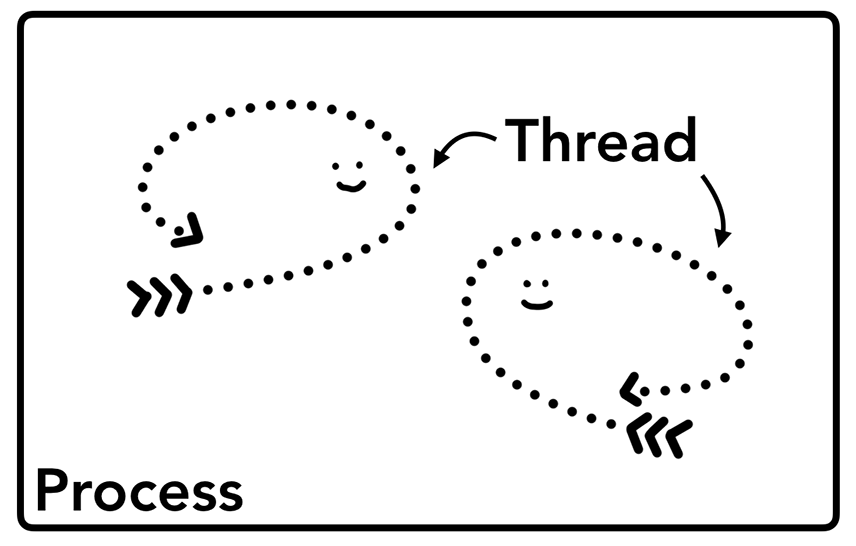
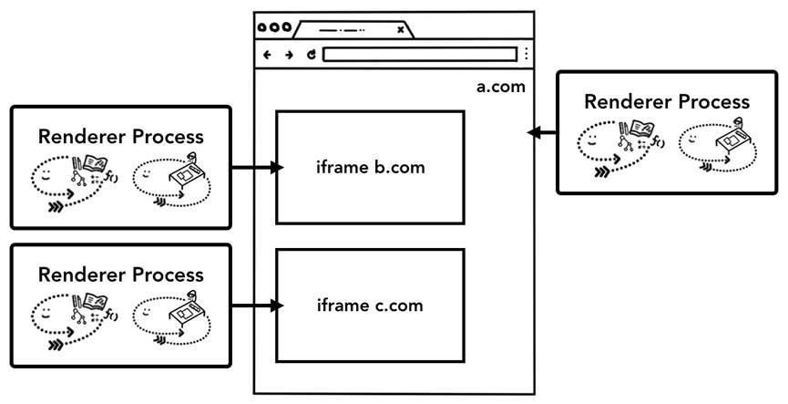

# 최신 브라우저의 내부 살펴보기

[toc]

## CPU, GPU, 메모리 그리고 다중 프로세스 아키텍처

### 컴퓨터의 핵심은 CPU와 GPU이다

#### CPU

CPU(central processing unit, 중앙처리장치)는 컴퓨터의 두뇌라 할 수 있다. CPU 코어는 여러 종류의 작업을 하나씩 순서대로 처리할 수 있다. CPU 코어 하나는 동일한 칩에 있는 또 다른 CPU나 마찬가지이다. 최신 하드웨어는 보통 하나 이상의 코어를 사용해 스마트폰이나 노트북의 실행 성능을 높인다.

#### GPU

CPU와 달리 GPU(graphics processing unit, 그래픽처리장치)는 간단한 작업에만 특화되어 있지만 여러 GPU 코어가 동시에 작업을 수행할 수 있다. GPU는 그래픽 작업을 처리하기 위해 개발되었다. 최근 몇 년 동안 GPU 가속을 통해 GPU가 단독으로 처리할 수 있는 계산이 점점 더 많아졌다.

> 특정 작업을 CPU가 아닌 다른 특별한 장치를 통해 수행 속도를 높이는 것을 `하드웨어 가속(hardware accelerated)` 이라 한다. 그래픽이나 사운드와 관련된 작업에 하드웨어 가속을 많이 사용한다. 브라우저에서 하드웨어 가속은 주로 GPU를 사용한 그래픽 작업의 가속을 의미한다. 간단한 작업을 동시에 수많은 코어가 수행하는 GPU의 특성을 기반으로 그래픽 작업이 훨씬 바르게 처리될 수 있다.
> \- [Mythbusters Demo GPU versus CPU](https://www.youtube.com/watch?v=-P28LKWTzrI)

컴퓨터나 스마트폰에서 애플리케이션을 실행할 때 애플리케이션을 구동하는 것이 바로 CPU와 GPU이다. 일반적으로 애플리케이션은 운영체제에서 제공하는 메커니즘을 통해 CPU와 GPU에서 실행된다.

### 프로세스와 스레드로 프로그램 실행

프로세스는 애플리케이션이 실행하는 프로그램이라 할 수 있다. 스레드는 프로세스 내부에 있으며 프로세스로 실행되는 프로그램의 일부를 실행한다.

애플리케이션을 시작하면 프로세스가 하나 만들어진다. 프로세스가 작업을 하기 위해 스레드를 생성할 수도 있지만 선택 사항이다. 운영체제는 프로세스가 작업할 메모리를 `한 조각` 주는데, 이 전용 메모리 공간에 애플리케이션의 모든 상태가 저장된다. 애플리케이션을 닫으면 프로세스가 사라지고 운영체제가 메모리를 비운다.

프로세스는 여러 작업을 수행하기 위해 운영체제에 다른 프로세스를 실행하라고 요청할 수 있다. 그러면 메모리의 다른 부분이 새 프로세스에 할당된다. 두 프로세스가 서로 정보를 공유해야 할 때는 IPC(inter process communication, 프로세스 간 통신)를 사용한다. 많은 애플리케이션이 이러한 방식으로 작동하도록 설계되어 있다. 그래서 작업 프로세스가 응답하지 않을 때 애플리케이션의 다른 부분을 실행하는 프로세스를 중지하지 않고도 응답하지 않는 프로세스를 다시 시작할 수 있다.

### 브라우저 아키텍처

브라우저는 스레드를 많이 사용하는 프로세스 하나만 사용할 수도 있고, 스레드를 조금만 사용하는 프로세스를 여러 개 만들어 IPC로 통신할 수도 있다.

여기에서 주목해야 할 중요한 점은 이러한 서로 다른 아키텍처가 구현 세부 사항이라는 점이다. 브라우저를 만드는 방법에 대한 표준은 없다. 브라우저마다 접근 방식이 완전히 다를 수 있다.

#### Chrome의 최근 아키텍처

제일 위에 있는 브라우저 프로세스는 애플리케이션의 각 부분을 맡고 있는 다른 프로세스를 조정한다. 렌더러 프로세스는 여러 개가 만들어져 각 탭마다 할당된다. 최근까지 Chrome은 탭마다 프로세스를 할당했다. 이제는 사이트(iframe에 있는 사이트 포함)마다 프로세스를 할당한다.

> 탭마다 프로세스를 할당하는 방법을 `process per tab` 이라 하고, 사이트마다 프로세스를 할당하는 방법을 `process per site` 라고 한다.

### 어떤 프로세스가 무엇을 담당하나

| 프로세스          | 프로세스가 제어하는 부분                                                                                                                                                                      |
| ----------------- | --------------------------------------------------------------------------------------------------------------------------------------------------------------------------------------------- |
| 브라우저 프로세스 | 주소 표시줄, 북마크 막대, 뒤로 가기 버튼, 앞으로 가기 버튼 등 애플리케이션의 `chrome` 부분을 제어한다. 네트워크 요청이나 파일 접근과 같이 눈에 보이지는 않지만 권한이 필요한 부분도 처리한다. |
| 렌더러 프로세스   | 탭 안에서 웹 사이트가 표시되는 부분의 모든 것을 제어한다.                                                                                                                                     |
| 플러그인 프로세스 | 웹 사이트에서 사용하는 플러그인(예: Flash)을 제어한다.                                                                                                                                        |
| GPU 프로세스      | GPU 작업을 다른 프로세스와 격리해서 처리한다. GPU는 여러 애플리케이션의 요청을 처리하고 같은 화면에 요청받은 내용을 그리기 때문에 GPU 프로세스는 별도 프로세스로 분리되어 있다.               |

> 소문자로 시작하는 `chrome`은 브라우저 이름이 아니라 브라우저의 UI 영역을 의미하는 말이다.

이 외에도 확장 프로그램(Extension) 프로세스, 유틸리티 프로세스 등 더 많은 프로세스가 있다.

### 다중 프로세스 아키텍처가 Chrome에 주는 이점

Chrome이 렌더러 프로세스를 여러 개 사용한다. 가장 간단한 예로 탭마다 렌더러 프로세스를 하나 사용하는 경우를 생각해 보면, 3개의 탭이 열려 있고 각 탭은 독립적인 렌더러 프로세스에 의해 실행된다. 이때 한 탭이 응답하지 않으면 그 탭만 닫고 실행 중인 다른 탭으로 이동할 수 있다. 만약 모든 탭이 하나의 프로세스에서 실행 중이었다면 탭이 하나만 응답하지 않아도 모든 탭이 응답하지 못하게 된다.

한 탭이 응답하지 않더라도 다른 탭은 사용 가능하다는 점은 각 탭마다 독립적인 렌더러 프로세스를 유지했을 때의 이점이다. 웹 페이지에서 처리할 작업이 많아 응답하지 못하는 경우나 웹 페이지를 담당하던 렌더러 프로세스의 실행이 중단된 경우 등에 이런 이점을 확인할 수 있다.
한편 같은 원리로 브라우저 프로세스와 렌더러 프로세스를 분리했을 때의 장점도 생각할 수 있다. 렌더러 프로세스가 웹 페이지를 그리는 도중 오류가 발생해 실행이 중단되더라도 브라우저 전체가 종료되지 않고 오류 페이지를 보여 주는 정도로 문제를 처리할 수 있다.

브라우저의 작업을 여러 프로세스에 나눠서 처리하는 방법의 또 다른 장점은 `보안` 과 `격리(sandbox)` 이다. 운영체제를 통해 프로세스의 권한을 제한할 수 있어 브라우저는 특정 프로세스가 특정 기능을 사용할 수 없게 제한할 수 있다. 예를 들어 Chrome은 렌더러 프로세스처럼 `임의의 사용자 입력` 을 처리하는 프로세스가 임의의 파일에 접근하지 못하게 제한한다.

> `임의의 사용자 입력` 은 웹 페이지의 실행으로 이해할 수 있다.

프로세스는 전용 메모리 공간을 사용하기 때문에 공통부분( ex) Chrome의 JavaScript엔진인 V8 )을 복사해서 가지고 있는 경우가 많다. 동일한 프로세스의 스레드가 메모리를 공유할 수 있는 데 반해 서로 다른 프로세스는 메모리를 공유할 수 없어 메모리 사용량이 더 많아질 수 밖에 없다. Chrome은 메모리를 절약하기 위해서 실행할 수 있는 프로세스의 개수를 제한한다. 프로세스의 개수가 한도에 다다르면 동일한 사이트를 열고 있는 여러 탭을 하나의 프로세스에서 처리한다.

> 다중 프로세스 아키텍처가 Chrome이 메모리를 많이 사용하는 이유이다. 다만 다중 프로세스 아키텍처는 안정적이고 빠른 사용자 경험과 보안을 제공한다는 장점이 있다.

### 더 많은 메모리 절약 - Chrome의 서비스화

동일한 접근 방식이 브라우저 프로세스에도 적용된다. Chrome은 브라우저의 각 부분을 서비스로 실행해 여러 프로세스로 쉽게 분할하거나 하나의 프로세스로 통합할 수 있도록 아키텍처를 변경하고 있다.

성능이 좋은 하드웨어에서 Chrome이 실행 중일 때에는 각 서비스를 여러 프로세스로 분할해 안정성을 높이고, 리소스가 제한적인 장치에서 실행 중일 때에는 서비스를 하나의 프로세스에서 실행해서 메모리 사용량을 줄이는 것이 기본 아이디어이다.

### 프레임별로 실행되는 렌더러 프로세스 - 사이트 격리

사이트 격리(site isolation)는 Chrome에서 최근 도입된 기능으로, iframe의 사이트를 별도의 렌더러 프로세스에서 실행하는 것이다. 탭마다 렌더러 프로세스를 할당하는 모델에서는 iframe의 사이트가 같은 렌더러 프로세스에서 작동하기 때문에 서로 다른 사이트 간에 메모리가 공유될 수 있다는 문제가 있다. `a.com` 사이트의 웹 페이지와 `b.com` 사이트의 웹 페이지를 동일한 렌더러 프로세스에서 실행하는 것이 문제가 없어 보일 수 있지만 `동일 출처 정책(same origin policy)` 은 웹 보안 모델의 핵심이다. 한 사이트는 동의 없이 다른 사이트의 데이터에 접근할 수 없어야 한다. 이 정책을 우회하는 것이 바로 보안 공격의 주요 목표이다. 프로세스를 격리하는 것이 사이트를 격리하는 가장 효과적인 방법이다. Meltdown과 Spectre 사태로 여러 프로세스를 사용해 사이트를 격리해야 한다는 것이 더욱 분명해졌다. Chrome 67부터 데스크톱에서 사이트 격리를 기본으로 사용하도록 설정하면서 탭에서 iframe의 사이트에 별도의 렌더러 프로세스가 적용된다.

[Inside look at modern web browser (part 1)](https://developers.google.com/web/updates/2018/09/inside-browser-part1#%ED%94%84%EB%A1%9C%EC%8A%A4%EC%84%B8%EC%99%80_%EC%8A%A4%EB%A0%88%EB%93%9C%EC%97%90%EC%84%9C_%ED%94%84%EB%A1%9C%EA%B7%B8%EB%9E%A8_%EC%8B%A4%ED%96%89)
[최신 브라우저의 내부 살펴보기 1 - CPU, GPU, 메모리 그리고 다중 프로세스 아키텍처](https://d2.naver.com/helloworld/2922312)
